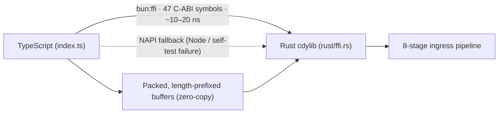

# Case study — building a Rust-accelerated HTTP pipeline for Bun

**castrum** is a hybrid TypeScript + Rust package that gives Bun servers native
speed for the work that actually costs CPU — request validation, parsing,
hashing, crypto, and a full HTTP ingress pipeline — behind a small, flat API.
This document tells the story of how it was built and measured, what the
benchmarks actually showed, and the lessons that generalise to any
"should I write this in Rust?" decision.

All figures below come from the reports in `bench/results/` (generated on a
release addon, baseline CPU, Bun 1.4.0). They're **representative**, not
advertised as universal — re-run `bun run check` / `bun run bench:http` on your
own hardware before trusting them for your numbers.

---

## 1. Background: the problem

Bun is already very fast. The gap that motivated castrum was not "Bun is slow"
but three specific frictions:

1. **CPU-bound request work runs in JavaScript.** JSON validity checking, email
   / UUID / IP validation, query & cookie parsing, hashing, and schema
   validation are pure CPU. In JS they compete with the event loop; the moment
   a request needs several of them, tail latency climbs.
2. **Production HTTP servers need a lot of "plumbing" middleware.** CORS,
   rate limiting, body-size guards, schema validation, security headers,
   request IDs, metrics. Hand-wiring these into `Bun.serve` is repetitive and
   error-prone; pulling in a framework drags in a dependency graph.
3. **Bun and Node want different integration stories.** The same logic should
   run on Bun (the primary target, zero startup cost) and Node ≥ 20.3 (a
   compiled ESM entry) without two implementations.

The hypothesis: a **hybrid** design — ergonomic TypeScript on top of one Rust
cdylib — could remove the CPU cost from the event loop, package the middleware
as a pre-baked pipeline, and still be usable from both runtimes.

---

## 2. The approach

### 2.1 One cdylib, two transports

The addon is built with napi-rs (so Node can load it), but it *also* exports
`extern "C"` symbols (`rust/ffi.rs`, **47 `castrum_*` symbols**) so Bun can
`dlopen` it directly:

- **`bun:ffi` (primary on Bun)** — Bun JIT-calls the C-ABI exports at
  ~10–20 ns per crossing, roughly an order of magnitude cheaper than a NAPI
  call. A **bind-time self-test** verifies every symbol and the ingress layout
  blob; on *any* failure the layer disables itself and calls fall back to NAPI.
- **NAPI (fallback)** — used under Node, when `CASTRUM_FFI_MODE=napi`, or when
  the self-test fails. It's the safety net that keeps the same code working on
  both runtimes.



### 2.2 Zero-copy, zero-alloc request handling

Instead of marshalling objects, the hot path **packs** the request frame
(method kind, URL, client IP, request ID, headers) into a shared `Uint8Array`,
Rust parses it and writes a decision into a **single output buffer**, and TS
decodes only the fields it needs. Hot paths allocate nothing per request;
pooled output buffers (with an adaptive-estimate size heuristic) are reused.

### 2.3 The ingress pipeline as a product, not a library

The 8-stage pipeline (trust/IP → HTTPS → CORS → rate limit → body guard →
JSON/schema → serialize cookies/query → write output) ships twice:
`createIngressServer` wraps it in a `Bun.serve` route table, and the same
handlers run over `node:http` via `createIngressServerNode`.

> **Two wire formats on purpose.** The low-level fast path emits
> `{"error":{...}}` with `x-ratelimit-*`; the pre-baked server emits
> `{"ok":true,...,"requestId":...}` with `ratelimit-*`. They are a **contract**
> the load generator validates — unifying them would break the benchmark
> baseline. (Recorded in `docs/adr/0001-two-wire-formats.md`.)

---

## 3. Results

### 3.1 Startup & first call (the "is it instant?" test)

From `bench/results/startup/latest.json` (Bun 1.4.0, 15 iterations):

| Metric | p50 | p95 |
|--------|-----|-----|
| Import the package (raw `index.ts`, no build step) | ~90 ms | ~112 ms |
| First `rust.crc32` call (ffi transport already warm) | ~0.04 ms | ~0.08 ms |
| First ingress pipeline call (addon loaded) | ~2.6 ms | ~5.3 ms |

The important number is the first-*call* cost: the cdylib is lazy-loaded, so
the import itself doesn't pay a native-init penalty.

### 3.2 CPU: where Rust wins, and where it doesn't

The CPU benchmark races every `rust.*` op against a pure-JS baseline **and**
Bun's built-ins (`docs/bun-builtins-decision-matrix.md`, release addon,
2026-08-11). Ratio > 1 = Bun is faster.

| Op | Bun built-in | Ratio | Verdict |
|----|--------------|-------|---------|
| `passwordHash` (argon2id) | `Bun.password.hashSync` | **0.55** (rust 1.83×) | **keep rust** |
| `passwordVerify` (argon2id) | `Bun.password.verifySync` | **0.53** (rust 1.88×) | **keep rust** |
| `passwordVerifyBcrypt` | `Bun.password.verifySync` | **0.67** (rust 1.49×) | **keep rust** |
| `pbkdf2Sha256` | `node:crypto.pbkdf2Sync` | 0.93 (parity) | keep rust |
| `fnv1a64` | `Bun.hash` (wyhash) | 1.06 | parity |
| `hmacSha256` | `Bun.CryptoHasher` | 1.1–1.4 | mild Bun win |
| `randomToken` | `Bun.randomUUIDv7` | 1.62 | **Bun wins** |
| `gzipDecompress` | `Bun.gunzipSync` | 1.38 | Bun wins* |
| `gzipCompress` | `Bun.gzipSync` | 2.02 | **Bun wins** |
| `crc32` | `Bun.hash.crc32` | 2.8–8.4 | **Bun wins** |
| `xxh3` | `Bun.hash.xxHash3` | 4.15 | **Bun wins** |
| brotli / zero-DOM JSON / parsers | *no sync Bun equivalent* | — | keep rust |

\* `gzipDecompress` deliberately stays native: the Rust path enforces a **64 MiB
decompression-bomb cap** that `Bun.gunzipSync` lacks.

**The honest takeaway:** "native is faster" is *not* automatic. The repo encodes
the verdict per function in `PROVEN_SURFACE` and marks the losers
`@deprecated` in their JSDoc — so `rust.jsonParse` (loses ~5× to `JSON.parse`)
and `rust.xxh3` (loses 4× to `Bun.hash.xxHash3`) are flagged, while argon2id
and the zero-DOM JSON path are advertised as wins. A consumer-facing selection
surface (`opImpl` / `isNativeOp` / `opDecision`) lets frameworks bind each op to
native or JS **once at load time** instead of per call.

### 3.3 HTTP: the pipeline holds up under load

From `bench/results/*/03-stress.bench.md` (ramp to 10k concurrent, ~104 s):

| Server | Achieved RPS | Total requests | Unexpected errors | Shape failures |
|--------|-------------|----------------|-------------------|----------------|
| raw `Bun.serve` | 862.5 | 92,174 | 0 | 0 |
| **castrum ingress** | **904.2** | **94,060** | **0** | **0** |

Under extreme concurrency both saturate and show long tail latencies (p99 ~18 s
on this machine) — that's the load generator over-driving the box, not a bug.
The meaningful result is that adding the full pipeline (CORS + rate limit +
body guard + schema + security headers + request IDs) costs **no correctness
and no measurable throughput** versus a hand-rolled raw server.

### 3.4 The bug that almost killed the server: C-ABI panics

The most instructive moment: under `11-concurrent-burst`, the ingress server
**died at ~2.5 s and stayed down** (91% network errors). Root cause: the `bun:ffi`
`extern "C"` exports had no panic guard. A panic in a napi call becomes a JS
exception, but a panic unwinding through raw `extern "C"` is undefined behaviour
that takes the whole process down.

The fix (in `rust/ffi.rs`): every fallible / allocating C-ABI export now routes
its core through `panic_guard` (`catch_unwind`) and reports a sentinel instead
of panicking. After the fix, the same scenario completes cleanly:

| Scenario (post-fix) | Requests | Network errors | Unexpected errors |
|---------------------|----------|----------------|-------------------|
| `11-concurrent-burst` | 30,211 | 0 | 0 |

**Lesson:** if you expose a raw C ABI to a host runtime, you own the unwind
boundary. Never assume a panic can't escape — contain it explicitly, and make
your bind-time self-test exercise the fallible paths.

### 3.5 Correctness as a first-class gate

The HTTP smoke scenario (`01-smoke`) is a **wire-format guard**, not a
throughput test: it verifies `ok === true` + `requestId` on success and
`error.code` / `error.message` on failure for every response. Across the
scenarios, `shape_failures` and `unexpected_statuses` are 0 — the two wire
formats are validated every CI run, so a change to the response shape breaks
the benchmark, not prod.

---

## 4. Engineering decisions & lessons

1. **Two transports, one binary.** Build with napi-rs (portability), export
   `extern "C"` (speed on Bun), and let a **bind-time self-test** pick the safe
   path automatically. Never let a transport failure be silent.
2. **Benchmark against the built-in, not just the baseline.** Bun's `Bun.hash.*`,
   `Bun.gzipSync`, `Bun.CryptoHasher`, and `Bun.randomUUIDv7` beat an FFI
   crossing on several ops. The rule that emerged: **keep Rust where it wins or
   where Bun has no synchronous equivalent; delegate where Bun wins.** Don't
   reinvent the wheel — `docs/adr/0003-bun-builtins-delegation.md`.
3. **"Native" is not a synonym for "fast".** The `proven` surface marks the
   losers. Let data, not enthusiasm, decide.
4. **A wire format is a contract.** Two deliberately-different formats are
   pinned by tests and the load generator. If you change the shape, you change
   the benchmark.
5. **Contain the C ABI.** A panic across `extern "C"` is a crash. Route every
   fallible export through a guard and cover it in the self-test.
6. **Zero-copy is a discipline.** Packed buffers, pooled outputs, lazy decode —
   every allocation you remove from the hot path is tail latency you never pay.
7. **Be honest about scope.** The rate limiter is **per-process, not
   distributed**; proxy trust is **off by default** (spoof-proof); the
   decompression bomb cap is **64 MiB**. Documenting the boundaries is as
   important as the speed.

---

## 5. Reproduce it yourself

```bash
bun install
bun run build              # release addon (baseline CPU — what ships)

bun run check              # CPU benchmark → bench/results/cpu/latest.json
bun run check:proven       # which rust.* ops beat their JS/Bun baseline?
bun run bench:startup      # import + first-call timing
bun run bench:http:smoke   # HTTP wire-format guard
bun run bench:http         # all HTTP scenarios (bun / elysia / ingress)
```

See [`BENCHMARKS.md`](./BENCHMARKS.md) for scenario descriptions and how to read
the reports.

---

## 6. When this pattern applies (and when it doesn't)

The hybrid TS + Rust + FFI pattern paid off here because the workload was
**CPU-bound, synchronous, and high-volume**. Reach for it when:

- Request handling spends measurable time in validation/parsing/hashing.
- You want a pre-baked HTTP pipeline (CORS, rate limit, schema, security
  headers) without a heavy middleware graph.
- You must support both Bun and Node from one codebase.

Don't reach for it when:

- The bottleneck is I/O or the database, not CPU — Rust won't help.
- You only need a handful of ops that Bun's built-ins already win (use
  `Bun.hash.crc32`, `Bun.gzipSync`, `Bun.randomUUIDv7` directly).
- You can't ship/ build a native `.node` in your deployment (no Rust toolchain
  in CI, or a locked-down runtime that forbids native addons).
