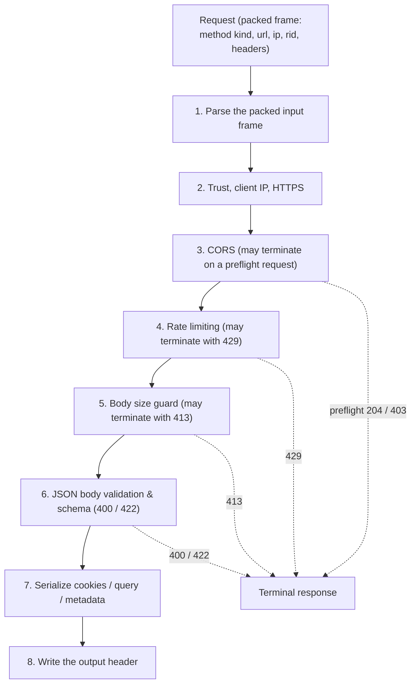

# Ingress Pipeline Documentation

## Overview

The Ingress pipeline is the core HTTP request processing system in castrum. It handles incoming requests through a series of processing stages, writing decisions to a binary output buffer that is then interpreted by the TypeScript caller.

The 8-stage native pipeline (shared by both consumption paths — see below):



Both the fast path (`createIngressFast`) and the pre-baked path
(`createIngressHandler`) drive the **same** native core (`handle_packed`); they
differ only in how the request frame is packed in JS and how the output buffer
is decoded on the way out.

---

## Quick Start

```ts
import { createIngress, createIngressFast } from "castrum";

// Fast synchronous handler (reuses internal buffers)
const fast = createIngressFast({
  parseCookies: true,
  parseQuery: true,
  cors: { allowOrigin: ["https://example.com"] },
  rateLimit: { limit: 100, windowMs: 60_000 },
});

// Inside your Bun server:
Bun.serve({
  fetch(req) {
    return fast.run(req, "192.168.1.1", null, "", (result) => {
      if (result.ok) {
        return new Response(JSON.stringify({ status: "ok" }), {
          headers: { "content-type": "application/json" },
        });
      }
      return new Response("Error", { status: result.status });
    });
  },
});

// Or use the async API (handles body reading automatically):
const handler = createIngress({
  requireJsonBody: true,
  schema: schemaBytes, // optional JSON Schema
  enableRequestIds: true,
});

Bun.serve({
  async fetch(req) {
    const ctx = await handler(req);
    if (ctx.response) return ctx.response; // terminal response (error)
    return new Response("OK", { status: 200 });
  },
});
```

---

## Pre-Baked Handlers (recommended for servers)

The fastest way to consume ingress in **any** system. `src/ingress/handlers.ts`
wraps the optimized native pipeline (`Ingress.handleRequestPacked`) and
provides ready-made route handlers, response builders, and a `Bun.serve`
builder — no need to hand-build responses, header templates, or error bodies.

All of these are exported from the package root and are **re-exported from the
benchmark server** (`bench/servers/ingress-server.ts`), which itself is built
entirely from them:

```ts
import { createIngressHandler, createIngressServer } from "castrum";

const ingress = createIngressHandler({
  parseCookies: true,
  parseQuery: true,
  cors: { allowOrigin: ["https://app.example.com"] },
  rateLimit: { limit: 1000, windowMs: 60_000 },
});

createIngressServer({
  port: 3000,
  routes: {
    "/health":    { read: ingress },                  // GET + HEAD
    "/api/users": { read: ingress, write: ingress },  // + POST/PUT/PATCH (+OPTIONS)
    "/api/echo":  { echo: ingress },                  // POST echo
  },
});
```

> **Wire format** (a contract — `bench/load.ts` depends on it):
> - Success (with `emitMetadataJson: true` — the bench enables it): the body is
>   Rust-generated `{"ok":true,"requestId":"...",...}`. With the DEFAULT
>   `emitMetadataJson: false` the success body is **empty** (lean reads) — serve
>   `result.bodyJson()` / `cookiesJson()` / `queryJson()` instead.
> - Errors: `{"ok":false,"error":{"code":"...","message":"..."}}` (rate limits
>   also include `"retry_after_ms"`).
> - Rate-limit headers use `ratelimit-limit/-remaining/-reset` (not
>   `x-ratelimit-*`). This differs from `createIngressFast`/`createIngress`,
>   which emit `{"error":{code,status,message,requestId}}`. Do not mix the two.

### `createIngressHandler(options, runtime?)`

Creates an optimized ingress handler (packs the request frame in JS via
`IngressInputPacker` + `gatherRawHeadersPacked` and drives the SAME native
core as `createIngressFast`, `handleRequestPacked`). `options` are the same
native options as `createIngressFast` (`trustProxy`, `https`,
`maxBodyBytes`, `enableBodySizeGuard`, `emitMetadataJson`, `cors`, `rateLimit`,
`parseCookies`, `parseQuery`, `schema`, `trustedProxies`, …).

`runtime` configures behavior that is not sent to Rust:

| Runtime option | Type | Default | Description |
|----------------|------|---------|-------------|
| `emitRequestIdHeader` | `boolean` | `false` | Echo `x-request-id` on responses |
| `enableSecurityHeaders` | `boolean` | `true` | Emit the configured security headers |
| `securityHeaders` | `[string,string][]` | — | Ordered security header pairs (names lowercased) |
| `outputBufferSize` | `number` | `131072` | Native output buffer size |
| `onRequest` | `(req, requestId, ip) => void` | — | Hook invoked before a request is processed |
| `onResponse` | `(req, result, status, requestId) => void` | — | Hook invoked after a `Response` is produced (metrics/logging) |
| `onError` | `(req, requestId, error) => void` | — | Hook invoked when the native pipeline fails (silent 500s are otherwise invisible) |
| `structuredLog` | `boolean` | `false` | Emit one JSON line per request/error (gated by `CASTRUM_LOG_LEVEL`) |

Returns an `OptimizedIngressHandler`:

```ts
interface OptimizedIngressHandler {
  // Run one request through the pipeline. The callback MUST be synchronous;
  // the result is invalidated after it returns.
  run<T>(req, ip, body, fn: (result: BakedIngressResult, ctx: BakedContext) => T): T;

  // Pre-baked response builders, bound to this handler's config:
  responseHeaders(variant, requestIdHeader, origin, rateRemaining?, rateResetSecs?, retryAfterSecs?): [string,string][];
  terminalHeaders(variant, ctx, result): [string,string][];
  terminalResponse(req, result, ctx): Response | null;   // null when not terminal
  errorResponse(req, result, status, code, message, ctx): Response;
  internalErrorResponse(ctx, result?): Response;
  withContentType(headers, contentType): [string,string][];
}
```

### Route-handler factories

Each factory takes an `OptimizedIngressHandler` and returns a
`(req, srv?) => Response | Promise<Response>` route handler compatible with any
fetch-style server (Bun, Deno, Node `server.fetch`, …). `srv` is the server
object used for `requestIP` when `getIp` is provided.

| Factory | Wires | Behavior |
|---------|-------|----------|
| `readHandler(ingress, opts?)` | GET | Returns the ingress body JSON (200) or a terminal/error response |
| `headHandler(ingress, opts?)` | HEAD | Same as read, no body |
| `jsonWriteHandler(ingress, opts?)` | POST/PUT/PATCH | Enforces `Content-Type`, body-size, JSON validity and schema; returns body JSON or 415/413/400/422 |
| `echoHandler(ingress, opts?)` | POST | Streams the request body back with the client's Content-Type |
| `deleteHandler(ingress, opts?)` | DELETE | Read-style handler for DELETE requests (same as `readHandler`) |
| `optionsHandler(ingress, opts?)` | OPTIONS | CORS preflight → 204 (allowed) / 403 from the native pipeline |
| `fallbackHandler(ingress, opts?)` | any | 404 for unmatched routes |

`BakedHandlerOptions`:

| Option | Type | Default | Description |
|--------|------|---------|-------------|
| `getIp` | `(req, srv) => string \| undefined` | — | Resolve client IP from the server object (e.g. `srv.requestIP`) |
| `copyBody` | `boolean` | `true` | Copy body slices instead of sharing the native buffer (safe) |
| `maxBodyBytes` | `number` | `1,048,576` | Body limit for write/echo handlers |
| `bodyTimeoutMs` | `number` | `30,000` | Overall body-read deadline for write/echo routes (0 = disabled) |
| `fallback` | `OptimizedIngressHandler` | `ingress` | Handler used for write error paths |

### `createIngressServer(options)` — Bun.serve builder

```ts
interface CreateIngressServerOptions {
  port: number;
  hostname?: string;            // default "0.0.0.0"
  idleTimeout?: number;         // default 30
  maxRequestBodySize?: number;  // socket-level cap, default 16 MiB
  reusePort?: boolean;          // SO_REUSEPORT (with automatic retry on failure)
  copyBody?: boolean;           // default true
  getIp?: (req, srv) => string | undefined;
  routes: Record<string, BakedRoute>;
  fallback?: OptimizedIngressHandler;  // unmatched routes + OPTIONS fallback
  onError?: (info: { error: Error; request?: Request }) => void; // Node adapter
}

interface BakedRoute {
  read?: OptimizedIngressHandler;      // -> GET + HEAD
  write?: OptimizedIngressHandler;     // -> POST/PUT/PATCH
  echo?: OptimizedIngressHandler;      // -> POST
  cookies?: OptimizedIngressHandler;   // -> GET
  delete?: OptimizedIngressHandler;    // -> DELETE (read-style)
  maxBodyBytes?: number;               // override for this route's write/echo
  bodyTimeoutMs?: number;              // overall body-read deadline (0 = disabled)
}

interface BakedServer {
  server: ServerHandle; // runtime-agnostic handle (stop(force?)); Bun exposes the full server via the same object
  stop(): void;         // stop accepting; on Bun force-closes, on Node drains then closes
  port: number;
}
```

### `createIngressServerNode(options)` — Node.js adapter

Bun remains the primary server target; `createIngressServer` is Bun-only. For
Node.js consumers, `createIngressServerNode` serves the SAME pre-baked route
handlers over `node:http` (sharing `buildRouteHandlers`). It returns a
`NodeIngressServer` (`BakedServer` plus an async `ready: Promise<number>` that
resolves to the bound port — use it with `port: 0`).

```ts
import { createIngressServerNode } from "castrum";
const srv = createIngressServerNode({ port: 3000, routes: { "/health": { read: ingress } } });
await srv.ready;         // listening
srv.server.stop(true);   // force-stop; srv.stop() drains then closes
```

### `gracefulShutdown(handles, options)`

Wires SIGTERM/SIGINT to a soft-drain-then-force stop for both Bun and Node
server handles:

```ts
import { gracefulShutdown } from "castrum";
const cleanup = gracefulShutdown([srv.server], { timeoutMs: 5_000 });
// cleanup() removes the signal listeners
```

### Observability: metrics, health probes, tracing

Enterprise-grade operators get three zero-dependency primitives (all exported
from the package root):

**Metrics** — `createIngressMetrics()` returns a registry + the
`onRequest`/`onResponse`/`onError` hooks to pass into `createIngressHandler`,
plus a Prometheus `/metrics` route factory:

```ts
import { createIngressHandler, createIngressServer,
         createIngressMetrics, metricsHandler,
         livenessHandler, readinessHandler } from "castrum";

const metrics = createIngressMetrics();
const ingress = createIngressHandler(options, { ...metrics.runtime });

createIngressServer({
  port: 3000,
  routes: {
    "/healthz": { read: livenessHandler() },               // process alive
    "/readyz":  { read: readinessHandler(async () => await dbReady()) }, // deps up
    "/metrics": { read: metricsHandler(metrics) },         // Prometheus text
    "/api":     { read: ingress },
  },
});
```

Metric names follow `castrum_http_*`:
`castrum_http_requests_total{method,status}`, `castrum_http_request_duration_seconds{method,status}`,
`castrum_http_errors_total{code}`, `castrum_http_rate_limited_total`, and
`castrum_http_in_flight_requests`. The generic registry (`createMetrics()`) is
also exported for standalone use (counters/gauges/histograms + Prometheus text
rendering).

**Health probes** — `livenessHandler()` (always 200), `readinessHandler(check?)`
(200/503 via an async dependency check), `healthHandler(check?)`.

> **Route spec note**: `BakedRoute.read` also accepts a raw
> `(req) => Response` function (the probes and `metricsHandler` are plain
> functions), so the pattern above typechecks and runs on both Bun
> (`createIngressServer`) and Node (`createIngressServerNode`). Raw handlers
> are served for GET only and skip the ingress pipeline / OPTIONS preflight.
> See `examples/basic-server.ts` and the bench ingress server
> (`bench/servers/ingress-server.ts`), which wire `/metrics` + `/healthz`
> `/readyz` `/livez` end-to-end.

**Tracing** — W3C trace-context helpers: `parseTraceParent(header)`,
`createTraceId()`, `createSpanId()`, `serializeTraceParent(ctx)`. Wire an
`onRequest` hook to parse `req.headers.get("traceparent")` and thread
`traceId`/`spanId` into your structured logger:

### `BakedIngressResult`

The zero-alloc result passed to `run()` callbacks. Invalidated after `run()`
returns — capture what you need inside the callback.

| Field | Type | Description |
|-------|------|-------------|
| `status` | `number` | HTTP status |
| `verdict` | `number` | 0 = pass, 1 = terminal |
| `errorCode` | `number` | `ERR_CODE_*` enum |
| `headerVariant` | `number` | Precomputed header-set index |
| `rateRemaining` | `number` | Remaining requests in window |
| `rateResetMs` / `retryAfterMs` | `number` | Rate-limit reset / retry-after (ms) |
| `terminal` | `boolean` | Stop processing (error/preflight) |
| `ok` | `boolean` | 2xx/3xx and no errors |
| `isPreflight` / `corsAllowed` | `boolean` | CORS preflight state |
| `rateLimited` / `trustedProxy` | `boolean` | Rate-limit hit / trusted proxy |
| `bodyValidJson` / `schemaValid` | `boolean` | Body JSON / schema checks |
| `bodyTruncated` | `boolean` | Output truncated (buffer too small) |
| `body` | `Uint8Array` | Request body bytes |
| `bodyJson(copy)` | `Uint8Array` | Metadata/body JSON slice (`copy=true` for a copy) |

### Custom route using the response builders

```ts
import { createIngressHandler, readHandler } from "castrum";

const ingress = createIngressHandler({
  parseCookies: true,
  parseQuery: true,
  cors: { allowOrigin: ["https://app.example.com"], allowCredentials: true },
  rateLimit: { limit: 100, windowMs: 60_000 },
});

Bun.serve({
  port: 3000,
  routes: {
    "/health": { GET: readHandler(ingress) },
    "/v1/custom": {
      GET: (req, srv) =>
        ingress.run(req, undefined, null, (result, ctx) => {
          const terminal = ingress.terminalResponse(req, result, ctx);
          if (terminal) return terminal;
          if (result.rateLimited) {
            return ingress.errorResponse(req, result, 429, "rate_limited", "Too Many Requests", ctx);
          }
          return new Response(result.bodyJson(true), {
            status: 200,
            headers: ingress.responseHeaders(result.headerVariant, ctx.requestIdHeader, ctx.origin),
          });
        }),
    },
  },
});
```

---

## API Reference

### `createIngressFast(options?)`

Creates a **synchronous** ingress handler with zero allocations per request. Returns an `IngressFastHandler`.

```ts
interface IngressFastHandler {
  run<T>(
    req: Request,
    ip: string | undefined,
    body: Uint8Array | null,
    requestId: string,
    fn: (result: FastIngressResult) => T,
  ): T;
}
```

**Important**: The callback `fn` must be synchronous. The handler reuses internal buffers and invalidates the result after `fn` returns.

### `createIngress(options?)`

Creates an **asynchronous** ingress handler that reads request bodies automatically. Returns an `IngressHandler`.

```ts
interface IngressHandler {
  (req: Request, ip?: string): Promise<IngressContext>;
}

interface IngressContext extends IngressFastResult {
  response: Response | null; // null if ok, Response if terminal
}
```

### `createIngressSync(options?)`

Creates a synchronous handler with the same API as `createIngressFast` but with explicit body/requestId parameters:

```ts
interface SyncIngressHandler {
  run<T>(
    req: Request,
    ip: string | undefined,
    body: Uint8Array | null,
    requestId: string,
    fn: (result: IngressFastResult) => T,
  ): T;
}
```

---

## Options Reference

### `IngressFastOptions`

| Option | Type | Default | Description |
|--------|------|---------|-------------|
| `trustProxy` | `boolean` | `false` | Trust `X-Forwarded-For` and `X-Real-IP` headers |
| `trustedProxies` | `{ enabled, networks? }` | — | Fine-grained proxy trust with optional network whitelist |
| `parseCookies` | `boolean` | `false` | Parse `Cookie` header into structured JSON |
| `parseQuery` | `boolean` | `false` | Parse URL query string into structured JSON |
| `requireJsonBody` | `boolean` | `false` | Require body to be valid JSON |
| `schema` | `Uint8Array` | — | JSON Schema (as UTF-8 bytes) for body validation |
| `cors` | `CorsOptions` | — | CORS configuration |
| `rateLimit` | `{ limit, windowMs, maxEntries }` | — | Rate limiting configuration |
| `security` | `SecurityHeadersOptions` | — | Security headers configuration |
| `https` | `boolean` | — | Force HTTPS detection (overrides auto-detection) |
| `maxBodyBytes` | `number` | 1,048,576 | Maximum body size (1 MB) |
| `enableSecurityHeaders` | `boolean` | `true` | Enable automatic security headers |
| `enableRequestIds` | `boolean` | `true` | Generate unique request IDs |
| `enableBodySizeGuard` | `boolean` | `true` | Guard against oversized bodies |
| `emitMetadataJson` | `boolean` | `false` | Emit metadata JSON in output (request ID, path, etc.) |
| `readBody` | `boolean` | — | Explicitly control body reading (auto-detected based on other options) |
| `outputBufferSize` | `number` | 262,144 | Initial size of the output buffer |
| `limits` | `LimitsOptions` | — | Fine-grained size limits for URL, headers, cookies, etc. |

### `CorsOptions`

| Option | Type | Default | Description |
|--------|------|---------|-------------|
| `allowOrigin` | `string[]` | — | Allowed origins (empty or `["*"]` = wildcard) |
| `allowMethods` | `string[]` | `["GET", "HEAD", "POST"]` | Allowed HTTP methods |
| `allowHeaders` | `string[]` | — | Allowed request headers |
| `exposeHeaders` | `string[]` | — | Exposed response headers |
| `allowCredentials` | `boolean` | `false` | Allow credentials (disables wildcard origin) |
| `maxAge` | `number` | — | Preflight cache max-age (seconds) |

### `SecurityHeadersOptions`

| Option | Type | Default | Description |
|--------|------|---------|-------------|
| `contentSecurityPolicy` | `string` | — | `Content-Security-Policy` header value |
| `hsts` | `boolean` | — | Enable HSTS |
| `hstsMaxAge` | `number` | 31,536,000 | HSTS max-age (seconds) |
| `hstsIncludeSubdomains` | `boolean` | `false` | HSTS includeSubDomains |
| `hstsPreload` | `boolean` | `false` | HSTS preload |
| `frameOptions` | `string` | `"DENY"` | `X-Frame-Options` value |
| `nosniff` | `boolean` | `true` | `X-Content-Type-Options: nosniff` |
| `referrerPolicy` | `string` | `"no-referrer"` | `Referrer-Policy` value |
| `coep` | `string` | — | `Cross-Origin-Embedder-Policy` |
| `coop` | `string` | — | `Cross-Origin-Opener-Policy` |
| `corp` | `string` | — | `Cross-Origin-Resource-Policy` |
| `xssProtection` | `string` | — | `X-XSS-Protection` value |

### `RateLimitOptions`

| Option | Type | Default | Description |
|--------|------|---------|-------------|
| `limit` | `number` | — | Maximum requests per window |
| `windowMs` | `number` | 1000 | Window duration (milliseconds) |
| `maxEntries` | `number` | — | Maximum tracked IPs (LRU eviction) |

### `LimitsOptions`

| Option | Type | Default | Description |
|--------|------|---------|-------------|
| `maxUrlBytes` | `number` | 65,536 | Maximum URL length |
| `maxQueryBytes` | `number` | 16,384 | Maximum query string length |
| `maxCookieBytes` | `number` | 8,192 | Maximum cookie header length |
| `maxHeadersBytes` | `number` | 65,536 | Maximum packed headers length |
| `maxHeaders` | `number` | 100 | Maximum number of headers |
| `maxPairs` | `number` | 1,024 | Maximum cookie/query key-value pairs |

---

## Result Interface

### `FastIngressResult`

| Property | Type | Description |
|----------|------|-------------|
| `status` | `number` | HTTP status code |
| `verdict` | `number` | 0 = pass, 1 = terminal (error) |
| `flags` | `number` | Bitfield of FLAG_* values |
| `errorCode` | `number` | Error code enum |
| `terminal` | `boolean` | True if request processing should stop |
| `ok` | `boolean` | True if status is 2xx or 3xx and no errors |
| `https` | `boolean` | Request is HTTPS |
| `trustedProxy` | `boolean` | Request from trusted proxy |
| `hasCookies` | `boolean` | Cookie data present in output |
| `hasQuery` | `boolean` | Query data present in output |
| `bodyValidJson` | `boolean` | Body is valid JSON |
| `schemaValid` | `boolean` | Body passes JSON Schema validation |
| `corsAllowed` | `boolean` | CORS origin allowed |
| `isPreflight` | `boolean` | Request is a CORS preflight |
| `rateLimited` | `boolean` | Rate limit exceeded |
| `rateLimit` | `number` | Rate limit ceiling |
| `rateRemaining` | `number` | Remaining requests in window |
| `rateResetMs` | `number` | Timestamp when rate limit resets (ms) |
| `retryAfterMs` | `number` | Retry-After duration (ms) |
| `body` | `Uint8Array` | Original request body bytes |
| `headerVariant` | `number` | Header variant index (pre-computed header set) |
| `requestId` | `string` | Unique request identifier |
| `bodyTruncated` | `boolean` | Output data truncated |
| `cookiesJson()` | `string` | Lazy-decoded cookie JSON string |
| `queryJson()` | `string` | Lazy-decoded query JSON string |
| `bodyJson()` | `Uint8Array` | Lazy-decoded body metadata JSON bytes |

---

## Error Codes

| Code | HTTP Status | Description |
|------|-------------|-------------|
| `ERR_CODE_NONE` (0) | 200 / varies | No error |
| `ERR_CODE_CORS_PREFLIGHT` (1) | 403 / 204 | CORS preflight rejected (or allowed → 204) |
| `ERR_CODE_RATE_LIMITED` (2) | 429 | Rate limit exceeded |
| `ERR_CODE_BODY_TOO_LARGE` (3) | 413 | Body exceeds maxBodyBytes |
| `ERR_CODE_INVALID_JSON` (4) | 400 | Invalid JSON body |
| `ERR_CODE_SCHEMA_VALIDATION` (5) | 422 | Schema validation failed |
| `ERR_CODE_BAD_REQUEST` (6) | 400 | Malformed request |
| `ERR_CODE_REQUEST_TOO_LARGE` (7) | 431 | Request headers/URL too large |
| `ERR_CODE_INTERNAL` (8) | 500 | Internal error |

---

## Request ID Generation

Request IDs are generated using a counter-based approach (no crypto overhead):

```
┌────────────────────────────────────────────┐
│ 64-bit ID: [hi: 32 bits][lo: 32 bits]      │
│                                             │
│ hi = BOOT_RANDOM ^ (WORKER_ID << 16)        │
│ lo = monotonic counter (increments per call)│
└────────────────────────────────────────────┘
```

- **Format**: 16-byte hex string (e.g., `"a1b2c3d4e5f6a7b8"`)
- **Uniqueness**: Unique within a single process instance
- **Performance**: ~20x faster than `crypto.randomUUID()`

---

## Header Variant System

The header template system pre-computes all possible header combinations at initialization time to avoid dynamic header construction per request. Each variant is a bitmask:

| Bit | Value | Meaning |
|-----|-------|---------|
| 0 | 1 (HV_JSON) | JSON error response headers |
| 1 | 2 (HV_CORS_SIMPLE) | CORS simple (non-preflight) headers |
| 2 | 4 (HV_CORS_PREFLIGHT) | CORS preflight headers |
| 3 | 8 (HV_RATE_ACTIVE) | Rate limit headers (x-ratelimit-*) |
| 4 | 16 (HV_RATE_LIMITED) | Retry-After header |

At request time, Rust computes the appropriate variant index, and TypeScript uses it to look up the pre-built header set.

---

## Complete Example: Custom Middleware

```ts
import { createIngressFast, FastIngressResult } from "castrum";

const handler = createIngressFast({
  parseCookies: true,
  parseQuery: true,
  cors: {
    allowOrigin: ["https://app.example.com"],
    allowMethods: ["GET", "POST", "PUT", "DELETE"],
    allowHeaders: ["Content-Type", "Authorization"],
    allowCredentials: true,
  },
  rateLimit: {
    limit: 1000,
    windowMs: 60_000, // 1 minute
  },
  security: {
    hsts: true,
    hstsMaxAge: 31536000,
    frameOptions: "SAMEORIGIN",
    contentSecurityPolicy: "default-src 'self'",
  },
});

Bun.serve({
  port: 3000,
  async fetch(req) {
    const ip = req.headers.get("x-forwarded-for") ?? "0.0.0.0";

    return handler.run(req, ip, null, "", (result) => {
      if (result.terminal || !result.ok) {
        // Build error response using the status from the result
        return new Response(
          JSON.stringify({
            error: true,
            code: result.errorCode,
            message: getErrorMessage(result),
          }),
          {
            status: result.status,
            headers: {
              "content-type": "application/json",
              ...getCorsHeaders(result),
            },
          },
        );
      }

      // Access parsed data
      if (result.hasCookies) {
        const cookies = JSON.parse(result.cookiesJson());
        // use cookies...
      }

      if (result.hasQuery) {
        const query = JSON.parse(result.queryJson());
        // use query params...
      }

      // Successful request
      return new Response("Hello, world!", {
        status: 200,
        headers: { "content-type": "text/plain" },
      });
    });
  },
});

function getErrorMessage(result: FastIngressResult): string {
  const messages: Record<number, string> = {
    1: "CORS preflight rejected",
    2: "Too many requests",
    3: "Request body too large",
    4: "Invalid JSON body",
    5: "Schema validation failed",
    6: "Bad request",
    7: "Request too large",
    8: "Internal server error",
  };
  return messages[result.errorCode] ?? "Unknown error";
}

function getCorsHeaders(result: FastIngressResult): Record<string, string> {
  if (result.corsAllowed) {
    return {
      "access-control-allow-origin": "https://app.example.com",
      "access-control-allow-credentials": "true",
    };
  }
  return {};
}

---

## Framework Integration (Bun backend frameworks)

`castrum` ships framework-agnostic adapters (`src/integration/`) so you can embed
the ingress pipeline as a request stage in **Hono**, **Elysia**, or a plain
`Bun.serve` handler — no router changes needed.

### `createPipeline` — run the ingress as a request stage

`createPipeline` wraps `createIngressHandler` (path 2) and exposes:

- `handleRequest(req, ip?)` → `Promise<Response>` — a **fetch-compatible**
  handler: terminal (rate-limited / CORS-denied / schema-failed / bad body)
  requests get their error response, OK requests get a rendered response
  (default `{"ok":true,"requestId":...}`, or your own `render`).
- `preprocess(req, ip?)` → `Promise<PreprocessOutcome>` — the **middleware
  seam**: `{ terminal, response, result, ctx }`. When `terminal`, serve
  `response`; otherwise continue to your app handler with the snapshotted
  `result` and a per-request `ctx` (`requestId`, `ip`, `locals` map).
- `readBody(req)` — stream-read a body with the configured limits.

```ts
import { createPipeline } from "castrum";

// Plain Bun.serve — the whole pipeline behind a fetch handler
const pipeline = createPipeline({ options: { parseCookies: true } });
Bun.serve({ port: 3000, fetch: (req) => pipeline.handleRequest(req) });
```

```ts
// Hono-style middleware: short-circuit on terminal, else pass context through
const pipeline = createPipeline({
  options: { rateLimit: { limit: 100, windowMs: 60_000 } },
});

app.use("*", async (c, next) => {
  const { terminal, response, ctx } = await pipeline.preprocess(c.req.raw);
  if (terminal && response) return response; // 429 / 403 / 422 / 413
  c.set("ingress", ctx); // requestId, ip, locals
  await next();
});
```

### `createWebSocketUpgrade` — RFC 6455 upgrade handshake

`createWebSocketUpgrade(req, { protocols })` validates `Sec-WebSocket-Key`,
computes the accept key (native `rust.wsAcceptKey`), negotiates a subprotocol,
and returns `{ response, key, protocol }` or `null` when the request isn't a
valid upgrade. Pair it with your framework's own WebSocket server:

```ts
import { createWebSocketUpgrade } from "castrum";

Bun.serve({
  port: 3000,
  fetch(req, server) {
    const up = createWebSocketUpgrade(req, { protocols: ["chat"] });
    if (up && server.upgrade(req, { data: { protocol: up.protocol } })) {
      return up.response; // 101 Switching Protocols
    }
    return new Response("Not a websocket", { status: 400 });
  },
  websocket: { message(ws, msg) { ws.send(msg); } },
});
```

### `sseResponse` — server-sent events on the fast path

`sseResponse(events, init)` frames an (async) iterable of events with the
native `rust.sseEncodeEvent` and returns a `text/event-stream` `Response`:

```ts
import { sseResponse } from "castrum";

async function* tick() {
  for (let i = 0; i < 5; i++) {
    await Bun.sleep(250);
    yield { event: "tick", data: String(i) };
  }
}
return sseResponse(tick());
```
}