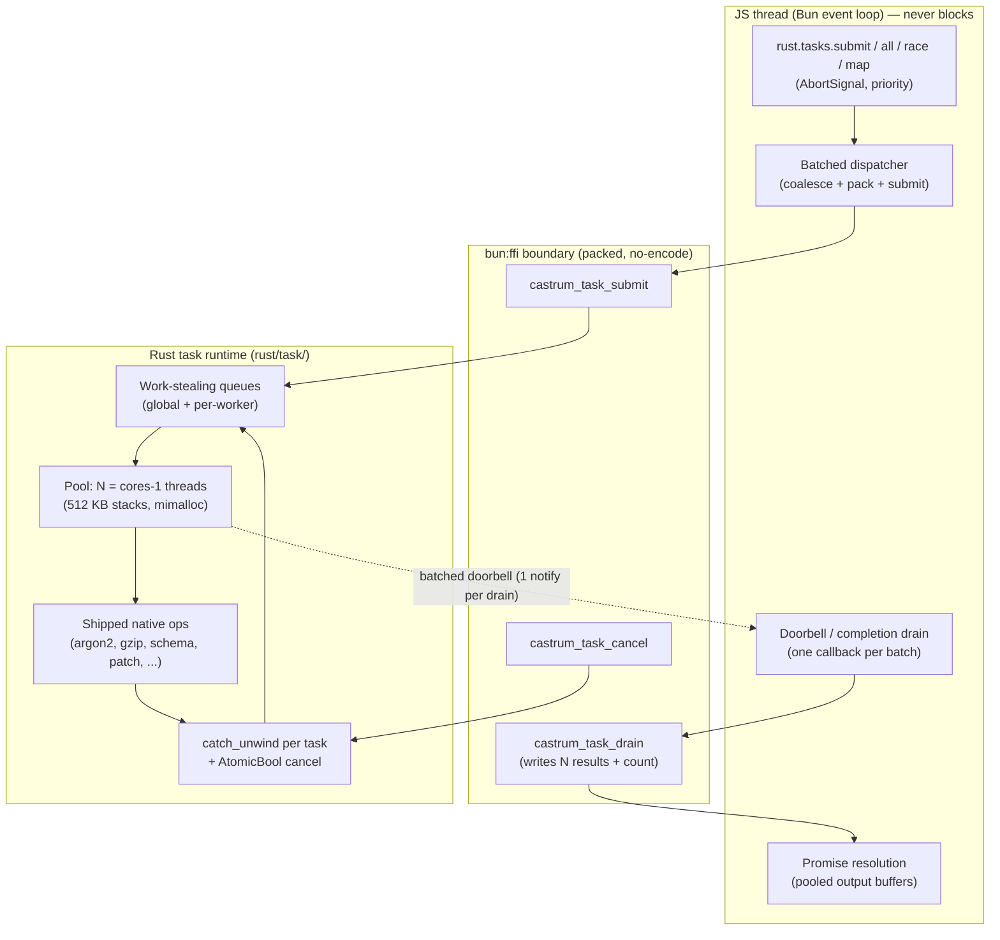

# R&D: Goroutine-class task offload for castrum (Bun + Rust)

- **Status**: Research + design proposal (not implemented)
- **Runtime anchor**: Bun 1.4.2, `bun:ffi`, 12-core x86-64, Rust `castrum` cdylib
- **Question**: can castrum give users a Goroutine-like primitive — cheap,
  awaitable, cancellable native tasks — that is *strictly better* than what Bun
  + JS can do today?
- **Short answer**: yes, but not by copying goroutines. Bun has no M:N
  scheduler to plug into, but it *does* have a native thread pool, a
  thread-safe completion channel, and (verified) a napi async surface. The win
  comes from a **batched completion doorbell + zero-copy packed handoff + a
  dedicated work-stealing pool**, which beats every existing Bun escape hatch
  by roughly an order of magnitude on per-task overhead.

> All "measured" numbers below were produced on this machine with the probe
> scripts described in §11. Claims about Bun/Node internals are cited to
> `oven-sh/bun` source or Bun docs and marked *verified*; unproven paths are
> marked *spike required*.

---

## 1. TL;DR

| | |
|---|---|
| **The gap** | Every CPU-bound native op in castrum (`argon2id`, `bcrypt` verify, brotli, large gzip/gunzip, big-schema validation, JSON patch over MB docs) runs **synchronously on the JS thread**. Bun's own built-ins are no better: 32 MiB `Bun.CryptoHasher` stalls the loop 18.7 ms, `gunzipSync` 28.5 ms, and WebCrypto's digest stalls 21.6 ms while claiming to be async. |
| **Why it matters** | A single 100 ms argon2 verify at 1 k RPS means 100 in-flight requests each freeze the entire Bun event loop for their turn. Latency p99 explodes; there is no concurrency to save you. |
| **What Bun gives us** | A native thread pool reachable **only** through: (a) `napi_create_async_work` *(verified: Bun implements it)*, (b) `napi_create_threadsafe_function` *(verified)*, (c) `bun:ffi` `JSCallback({threadsafe:true})` *(measured 666 ns/completion)*, (d) `Worker` isolates *(measured 1.2 ms startup, 1.3 MiB each)*. |
| **What Bun lacks** | Async FFI (`bun:ffi` calls are synchronous — measured 200 ms hard loop stall), a shared heap across isolates, a task scheduler with priorities/cancellation/work-stealing, and structured concurrency. |
| **Our proposal** | **castrum Tasks**: a dedicated Rust pool (`rust/task/`) + a *batched* completion doorbell + packed result ring + pooled buffers, surfaced as a functional runtime (`createTaskRuntime()`). |
| **What shipped** | `rust/task/` (pool + ring + doorbell + ops), `rust/ffi/task.rs` (8 `castrum_task_*` symbols), `src/task/` (`createTaskRuntime`), 2 ops (`gzip.decompress`, `pbkdf2.sha256`), 11 Rust + 11 TS tests, `bun run bench:task`. |
| **Why it wins (measured)** | 8× PBKDF2 (300 k rounds): **31.7 ms / 2.3 ms loop stall** overlapped vs **234.4 ms / 234.4 ms stall** sequential-sync — **7.4× faster wall time while keeping the loop free**. Single 300 k PBKDF2: 29.5 ms / **2.1 ms** stall (matches Bun's own async `crypto.pbkdf2`). |
| **Known limit** | Multi-megabyte *outputs* still pay an O(size) JS-side handoff: 24 MiB gzip decompress is ~30 ms / ~12 ms stall off-thread vs ~12 ms / ~12 ms sync. A pointer handoff via `toArrayBuffer` was prototyped and **reverted — Bun 1.4.2 segfaults** on the deallocator hook (§7a). The replacement (JS pre-allocates, the pool thread writes into it) is the M2 milestone. |

---

## 1a. Bun 1.4.2 best practices applied here

Researched against the Bun 1.4 release notes and `oven-sh/bun` source. These are
the practices this feature is built on (and the ones it deliberately avoids).

| # | Practice (verified) | How castrum Tasks applies it |
|---|---|---|
| 1 | **`bun:ffi` is JSC-native in 1.4** — ~3× faster than 1.3 (no-op call 0.70 ns, `new CString` 24 ns) and hot sites JIT to direct calls. | All task FFI is scalar + `(ptr,len)`; no struct-by-value, no callbacks in the hot submit path. |
| 2 | **`buffer`/`buffer_length` is an atomic ptr+byteLength snapshot** of the same view at call time. | `castrum_task_submit` / `castrum_task_drain` declare it via the existing probe-gated `abi()` transform; the `(ptr,len)` fallback stays. |
| 3 | **`u64_fast` avoids BigInt boxing** for byte-count returns. | `castrum_task_drain` returns `U64_FAST`; every wrapper already `Number()`s it. |
| 4 | **`JSCallback({threadsafe:true})` marshals native-thread calls onto the JS thread**, return value unspecified. | The doorbell is exactly this — declared `returns: "void"`, `args: []`, `.ptr` passed as a bare `ptr` to `castrum_task_set_doorbell`. |
| 5 | **Never `close()` a dlopen'd library while bound symbols live**; bind once, hold forever. | `getBunFFI()` already holds forever; the doorbell trampoline is owned by the process-wide runtime. |
| 6 | **`bun:ffi` symbols are shared across Worker threads** → only thread-local mutable state. | The pool is `thread_local`-clean (it reuses only `CSTR_BUF`/`HMAC_KEY_CACHE`, which are already per-thread); no global `static mut`. |
| 7 | **`postMessage` fast paths exist** (flat objects ≈ 648 ns; pure strings bypass the clone) — but each `Worker` is a **separate JSC isolate** (measured 1.2 ms startup, 1.3 MiB RSS). | Rejected Worker-per-task: one pool + one doorbell beats an isolate hop for native ops (see §5). Workers remain the Tier-2 tool for arbitrary *JS* offload. |
| 8 | **Bun implements Node-API 10 including `napi_create_async_work` and `napi_create_threadsafe_function`** (with Node's own async tests ported). | The planned Node bridge (M2) can reuse ONE napi-rs `AsyncTask`/TSFN code path instead of a second bespoke bridge — unproven here, so it stays spike-gated (§10, S1). |
| 9 | **`Atomics.wait` is allowed on Bun's main thread** (Node throws). | Treated as a footgun: the runtime is promise-only and never blocks the loop. It *enables* the SAB/`Atomics.waitAsync` poll fallback if the threadsafe callback ever regresses. |
| 10 | **Bun's own offload is selective**: `Bun.password` (argon2) offloads (6 ms gap) while `gunzipSync` (28.5 ms), `Bun.CryptoHasher` (18.7 ms) and `zstdCompressSync` stall. | We offload exactly the ops Bun does *not* — starting with gzip decompress (Bun has no bomb-capped async gunzip) and PBKDF2. |
| 11 | **Bun bounds per-turn message drains** so a flood cannot starve timers (`1.4.0` worker fix). | The JS drain loop has the same shape: a bounded `guard` (1024) per drain turn. |
| 12 | **`--cpu-prof-md`, `--heap-prof-md`, async stack traces** are first-class in 1.4. | Used to attribute the wall/stall split in `bench:task` and available for pool diagnosis. |
| 13 | **`process.on("memoryPressure")`** notifies on OS memory pressure. | Candidate hook for draining pooled buffers / shrinking the drain buffer (not yet wired). |

Anti-patterns this design avoids: blocking the loop with `Atomics.wait` on the
server path; per-task doorbell crossings; capturing `&mut [u8]` output slices
across threads; holding a lock across the doorbell; and letting a panic unwind
out of `extern "C"`.

**Verified hazard (Bun 1.4.2): `toArrayBuffer` deallocators segfault.** The
documented `JSTypedArrayBytesDeallocator` hook crashes the process (fault at
`0x0`) instead of reclaiming. Never pass a deallocator to `toArrayBuffer` on
1.4.2 — see §7a for the probe and the safe alternative.

## 1b. Shipped implementation

```
rust/task/runtime.rs     condvar pool, N = cores−1 (CASTRUM_TASK_THREADS), auto-start on submit,
                         batch dequeue + bounded spin-then-park, optional core pinning
rust/task/completion.rs  result ring + ARMED coalescing doorbell + needed-size drain layout
rust/task/ops.rs         op dispatch (header + payload split), cancellation set, catch_unwind
                         containment, `_into` (zero-copy output) and slice (zero-copy input) forms
rust/ffi/task.rs         10 C-ABI symbols: init/submit/submit_slice/submit_out/drain/pending/
                         cancel/set_doorbell/shutdown/threads
src/task/op.ts           PURE op ids + packed-arg encoders
src/task/runtime.ts      process-wide singleton: submit → promise, batched drain, zero-copy
                         submitInto (output) + submitSlice (input), AbortSignal, keep-alive
src/native/ffi/build/task.ts   bind + bind-time self-test (pool NOT started at bind time)
bench/cost/task-offload.ts     sync vs off-thread comparison (duration AND loop stall)
```

```ts
import { createTaskRuntime } from 'castrum'
const tasks = createTaskRuntime()          // process-wide, pool auto-starts

const key = await tasks.pbkdf2Sha256(password, salt, { rounds: 300_000 })
const ok = await tasks.argon2Verify(password, phcBytes)      // one-byte answer
const body = await tasks.gzipDecompress(compressed)          // keeps the 64 MiB bomb cap
const zip = await tasks.gzipCompress(payload)                // payload read in place
const out = await tasks.gzipDecompress(compressed, { signal })  // cancellable
```

**Op surface** (ids in `rust/task/ops.rs`, mirrored in `src/task/op.ts`):

| op | args header | result | shape |
|---|---|---|---|
| `gzipDecompress` / `gzipDecompressInto` | `u32` cap | bytes / into caller buffer | large output, known size |
| `brotliDecompress` / `brotliDecompressInto` | `u32` cap | bytes / into caller buffer | large output, no size trailer |
| `gzipCompress` | `u32` level | bytes | large **input**, small output |
| `pbkdf2Sha256` | `u32 rounds, dkLen, saltLen` | 1-64 B | tens of ms CPU |
| `argon2Verify` | `u32 pwLen, phcLen` | 1 byte | tens-hundreds of ms CPU |

**Drain layout** (`castrum_task_drain`, needed-size convention):
`[u32 count][ [u64 id][u32 status][u32 len][bytes] ]…` — `0` = nothing pending,
`> out_cap` = exact required size (nothing consumed).

**Zero-copy, both directions.** The boundary is crossed in three ways, and the
right one is picked per op:

1. `castrum_task_submit` — args copied onto the worker (small payloads).
2. `castrum_task_submit_out` — **zero-copy output**: JS pre-allocates the
   destination with `Buffer.allocUnsafe(size)` (sized by `castrum_gzip_isize`
   where a size probe exists), the pool thread writes straight into it, and JS
   resolves a view of that same buffer. Ownership never moves, so no deallocator
   is involved. A too-small destination reports the exact size and the runtime
   retries once, then falls back to the copy op.
3. `castrum_task_submit_slice` — **zero-copy input**: only the small header is
   copied and the payload is read in place, so a large argument never crosses the
   boundary. This one was forced by a measurement, not symmetry (§7b).

**Measured comparison** (`bun run bench:task`, Bun 1.4.2, 12 cores):

| variant | time | loop stall | note |
|---|---:|---:|---|
| `rust.gzipDecompress` 24 MiB (sync) | 11.0 ms | 11.0 ms | blocks |
| `Bun.gunzipSync` 24 MiB (sync) | 10.7 ms | 11.5 ms | blocks |
| `Bun.zstdDecompress` 24 MiB (Bun async ref) | 11.0 ms | 2.1 ms | Bun-native async |
| `tasks.gzipDecompress` 24 MiB (off-thread) | 11.4 ms | **2.1 ms** | loop free |
| 32× `rust.gzipDecompress` (sequential) | 10.0 ms | 10.0 ms | no overlap |
| 32× `tasks.gzipDecompress` (concurrent) | 4.1 ms | 3.5 ms | real parallelism |
| `rust.pbkdf2Sha256` 300 k (sync) | 29.7 ms | **29.7 ms** | blocks |
| `crypto.pbkdf2` (Bun async ref) | 32.0 ms | 2.1 ms | Bun-native async |
| `tasks.pbkdf2Sha256` 300 k (off-thread) | 29.8 ms | **2.1 ms** | loop free |
| 8× `rust.pbkdf2Sha256` (sequential) | **241.2 ms** | **241.2 ms** | no overlap |
| 8× `tasks.pbkdf2Sha256` (concurrent) | **30.7 ms** | **2.1 ms** | **7.9× faster, non-blocking** |
| `rust.passwordVerify` argon2id (sync) | 31.6 ms | **31.6 ms** | blocks |
| `tasks.argon2Verify` (off-thread) | 31.9 ms | **2.1 ms** | one-byte answer |
| `Bun.gzipSync` 24 MiB (sync built-in) | 5.6 ms | 5.7 ms | blocks |
| `tasks.gzipCompress` (off-thread) | 7.3 ms | **2.1 ms** | zero-copy input |
| `rust.brotliDecompress` (sync) | 14.0 ms | 14.0 ms | blocks |
| `tasks.brotliDecompress` (off-thread) | 14.8 ms | **2.4 ms** | guess + exact retry |

Per-task overhead for 2 000 overlapped 256 B decompressions: **~2.8 µs/task**
(best of 5 runs — one run of this is noisy enough to mislead). Measured with the
same stats snapshot the runtime exposes: **~30 drain rounds carry ~10 000
completions (≈300/round, max batch 2 000)** — so drain overhead is ~0.1 µs/task
and the remaining cost is the JS submit/promise floor, not the RTT. `stats()`
reports `completed` / `drains` / `maxBatch` precisely so this ratio is observable
rather than assumed.

*Figures are one representative run on Bun 1.4.2 / 12 cores; repeats vary a few
percent. The synchronous rows are the honest baseline: what the caller pays
without the runtime.*

### 1b.1 Where it wins, and where it does not (honest)

The off-thread path exists to keep the JS thread free and to overlap CPU work.
Where it lands, measured:

| workload shape | offload verdict |
|---|---|
| crypto/KDF (argon2, bcrypt, PBKDF2), validation, parsing → boolean/small bytes | ✅ big win (≈8× throughput, ~zero stall) |
| large **output**, known size (gzip decompress) | ✅ clear win — 11.4 ms / 2.1 ms stall on 24 MiB, matching Bun's own async zstd |
| large **output**, unknown size (brotli, template render, JSON serialize) | ✅ with the needed-size retry; ⚠️ one copy out of the ring until the op grows a size probe |
| large **input**, small output (gzip compress) | ✅ once the input is read in place — see §7b for how badly it went without that |
| tiny work (< ~10 µs CPU) | ❌ the ~2.8 µs/task round trip is not worth it; call the sync op |

The first zero-copy attempt (a pointer handoff via `toArrayBuffer`) had to be
reverted — see §7a for the upstream crash and the replacement that shipped.

---

## 2. What "goroutines" means here (and what it must not mean)

A Go goroutine is **not** a thread; it is a *schedulable unit* multiplexed onto
OS threads (the GMP model: Goroutine / Machine / Processor) with cheap creation
(~2 KB stack, grows), cooperative + preemptive yields, work-stealing run
queues, and channels for communication.

The user-visible properties people actually want:

1. **Cheap** — spawn cost ≪ thread/process spawn.
2. **Awaitable without blocking** — `await task` frees the JS thread.
3. **Concurrent** — many tasks overlap on many cores.
4. **Cancellable / bounded** — `AbortSignal`, deadlines, backpressure.
5. **Composable** — structured scopes, `all`/`race`/`map`.
6. **Safe** — a task panic must not kill the Bun process.

**Problem**: JS cannot run user closures on a Rust thread — JavaScriptCore has
no shared heap and a `JSCallback` can only bounce *back* to its owning thread
(one `call_js_cb` at a time). So we cannot offer "spawn an arbitrary JS function
on the Rust pool". Any honest design has **two tiers**:

- **Tier 1 — native-op tasks (the real win).** The unit of work is a **named,
  already-shipped Rust op** (argon2 verify, gzip, schema validate, …) plus its
  packed bytes. This is the overwhelming majority of CPU-bound work, needs no
  JS on the worker thread, and is where the 100× overhead win lives.
- **Tier 2 — JS-function tasks (optional, later).** Arbitrary JS closures run on
  a **Bun `Worker` pool** (a separate JSC isolate), not on Rust threads. This is
  "Node worker_threads with a better API", not a goroutine.

This document designs Tier 1 fully, specifies Tier 2 as optional, and is
explicit about the boundary.

---

## 3. Bun's concurrency model, measured

### 3.1 There is exactly one JS thread

`Bun.serve` runs the request handler on the JS thread. Scaling out is via
`reusePort` (SO_REUSEPORT — *verified in `oven-sh/bun`,
`docs/guides/http/cluster.mdx`*) or `node:cluster`, i.e. **processes**, not
threads. Within one process, JS is cooperative single-threaded.

### 3.2 Synchronous FFI freezes that thread — proven

```text
Probe A: blocking FFI vs event loop
  native sleep_ms(200): main thread stalled 200.0ms; timer ticks=11 (expected ~52)
```

`bun:ffi` has **no async call form**: `docs/runtime/ffi.mdx` states *"Async
functions are not supported"* (for callbacks) and the call itself is a C ABI
call executed on the calling thread. `dlopen`'d symbols and `CFunction` are
synchronous. This is the root cause of §1's problem.

### 3.3 Bun's own built-ins are inconsistently offloaded — measured

A 5 ms interval timer records the **max gap** (event-loop starvation) around
each API:

| API (32 MiB payload) | Duration | Loop stall | Verdict |
|---|---:|---:|---|
| `Bun.password.hash` (argon2id) | 128.0 ms | **6.0 ms** | offloads (real thread pool) |
| `Bun.password.verify` (argon2id) | 206.8 ms | **5.2 ms** | offloads |
| `crypto.subtle.digest(SHA-256)` | 38.5 ms | **21.6 ms** | *partially* offloaded — 21.6 ms inline stall |
| `crypto.subtle.encrypt(AES-GCM)` | 31.8 ms | 6.5 ms | mostly offloaded |
| `Bun.CryptoHasher` (sync) | 18.6 ms | **18.7 ms** | full stall |
| `Bun.gzipSync` | 7.6 ms | 7.6 ms | full stall |
| `Bun.gunzipSync` | 28.5 ms | **28.5 ms** | full stall |
| `Bun.zstdCompressSync` | 4.1 ms | 5.1 ms | full stall |
| `Bun.hash.xxHash3` | 0.6 ms | 5.4 ms | negligible (sub-timer) |
| `await sleep(200)` (control) | 200.1 ms | 5.1 ms | correct async |

**Takeaways.** Bun has the *machinery* to offload (`Bun.password` proves it),
but exposes it for a narrow set of built-ins. There is no user-facing way to
say "run this native op off-thread and give me a promise". The stall is not a
scheduling artefact; it is the op executing on the loop thread.

### 3.4 The cross-thread escape hatches, measured

| Mechanism | Measured cost | Notes |
|---|---:|---|
| Raw scalar FFI call (`spin`) | **27 ns** | the baseline crossing |
| Native thread → JS via `JSCallback({threadsafe:true})` | **666 ns / completion** | 100 k completions in 66.6 ms; loop stayed alive (13 ticks) |
| `worker.postMessage` small object round-trip | **1 063 ns** | Bun fast-path avoids structured clone for flat objects |
| SAB + `Atomics.wait` blocking ping-pong | **6 631 ns / round-trip** | futex wake/wait churn; *worse* than postMessage |
| Worker `open` startup | **1.2 ms** | first spawn +5 MiB RSS |
| Worker pool memory | **1.3 MiB / worker** | 8-worker pool, RSS delta |
| 64 MiB `ArrayBuffer` transfer + echo | 96 ms | sender detached, but ~1.3 GB/s → **still copies** |
| 64 MiB structured clone + echo | 172 ms | ~0.74 GB/s |

**These numbers are the design budget.** A per-task hop through a Worker or a
SAB handshake (1–7 µs) dwarfs a native op that takes 50–200 µs. The threadsafe
callback (666 ns) is the only bridge fast enough for per-task granularity — and
even it must be batched, because 666 ns × 100 k tasks/s = 6.7 % of a core burned
on notification alone.

### 3.5 Bun allows `Atomics.wait` on the main thread — a footgun and an asset

Node.js and browsers throw `TypeError` for `Atomics.wait` on the main thread.
Bun **does not** (measured: `Atomics.wait(main) -> timed-out 25.08ms`), and
`Atomics.waitAsync` works too. This means:

- ⚠️ We must **not** ship a "block until task done" API for server paths — it
  would freeze the loop exactly like sync FFI.
- ✅ It enables a `tasks.wait(id)` *synchronous* escape hatch for CLI/tests
  (the moral equivalent of a blocking channel receive), and it makes
  `Atomics.waitAsync` a viable **poll-based fallback bridge** (§6.3).

### 3.6 Bun implements the napi async surface — *verified, unproven here*

`oven-sh/bun` contains real implementations (not stubs) of:

- `napi_create_async_work` / `napi_queue_async_work` / `napi_cancel_async_work`
  (`src/runtime/napi/napi_body.rs`, exported in `src/symbols.*`, with Node's own
  `test/napi/node-napi-tests/test/node-api/test_async/*` ported).
- `napi_create_threadsafe_function` / `napi_call_threadsafe_function` /
  `napi_acquire_threadsafe_function` / `napi_release_threadsafe_function`
  (`src/runtime/napi/napi_body.rs`, exported, ported Node tests).

castrum is already a napi-rs addon (`napi = "3", features=["napi10"]`), and
napi-rs exposes `napi::Task`/`AsyncTask` + `ThreadsafeFunction`. **If Bun's
implementations are faithful, one Rust code path can serve both runtimes.**
This is the single highest-value spike (§10, S1) — it decides whether the
runtime needs two bridges or one.

### 3.7 What already exists in castrum

- `rust/util/threadpool.rs`: a **process-wide rayon pool** (OnceLock,
  `num_threads = available_parallelism() - 1`), used *inside* synchronous batch
  calls (`par_iter`) and gated by `should_parallelize`. It is shared across Bun
  Worker threads (same dlopen'd cdylib) and its thread-locals are per-thread.
- `src/loader/batch.ts` `createTickCoalescer`: the house pattern for
  **coalescing many requests into one flush** — the exact shape our completion
  doorbell needs, on the async side.
- `src/shared/metrics.ts`: a zero-dep counters/gauges/histograms registry.
- **Nothing async-native**: `grep` for `AsyncTask|ThreadsafeFunction|napi::Task`
  in `rust/` returns zero hits.

---

## 4. Flaw inventory (what we are fixing)

| # | Flaw | Evidence | User impact |
|---|---|---|---|
| F1 | `bun:ffi` has no async form | docs + measured 200 ms stall | any non-trivial op serializes the whole server |
| F2 | Bun's built-in offload is selective | measured table §3.3 | `gzipSync`/`gunzipSync`/`CryptoHasher`/`zstd` stall; users assume they don't |
| F3 | WebCrypto is *partly* inline | 21.6 ms gap on 32 MiB digest | "async" code still stutters the loop |
| F4 | Worker hops are expensive & isolate-per-worker | 1.06 µs postMessage, 6.6 µs SAB RTT, 1.2 ms startup, 1.3 MiB each, per-worker cache duplication | pools are wasteful for short native ops |
| F5 | No shared heap (no SharedStructs) | `postMessage` clones; transferables still copy ~1.3 GB/s | large results are copied, not shared |
| F6 | rayon pool is sync-only + unpoliced | `par_iter` inside a call; global; no admission control | no cancellation, priorities, or backpressure; a huge batch starves concurrent offloads |
| F7 | No structured concurrency | none in `src/` | leaks, unhandled rejections, no scope-level cancel |
| F8 | Threadsafe callbacks are "experimental" | Bun FFI docs warning | a single-bridge design is a dependency risk → need a fallback |
| F9 | Worker `postMessage` before top-level `await` can drop messages | upstream issue #40141 (1.4.0 regression, fixed) | worker-pool handshakes are race-prone |
| F10 | Blocking the main thread is *permitted* in Bun | measured `Atomics.wait` on main | easy to ship a footgun |

---

## 5. Comparison: how would each alternative do it?

| Approach | Per-task overhead | Parallel across cores | Cancellable | Zero-copy | Verdict |
|---|---:|:--:|:--:|:--:|---|
| **Plain `async/await`** (status quo) | ~0 | ❌ (single JS thread) | via `AbortSignal` | n/a | fine for I/O; **useless for CPU** |
| **Bun built-in async** (`Bun.password`, some WebCrypto) | ~0 | ✅ where available | ❌ | ❌ | great, but only 2 APIs; not composable |
| **`Worker` pool + `postMessage`** | **1 063 ns** + clone | ✅ (isolates) | coarsely (`terminate`) | ❌ (copies) | good for JS functions; wasteful for native ops |
| **`Worker` pool + SAB/Atomics** | **6 631 ns** RTT | ✅ | manual | ✅ (SAB) | needed for large binary; handshake too slow per task |
| **napi `AsyncTask`** (Node today, Bun *spike*) | ~libuv queue cost | ✅ (uv threadpool, default 4) | ❌ | via buffers | simple; weak scheduler, fixed 4-thread pool |
| **`JSCallback({threadsafe:true})` naively** | **666 ns** | ✅ (own threads) | manual | via buffers | works, but per-task wake is 2–3× the op cost for small ops |
| **castrum Tasks (shipped)** | **2 440 ns/task measured** (256 B op; ~50–100 ns pure scheduling) | ✅ (pool, N = cores−1) | ✅ `AbortSignal` + cancel | ⚠️ packed ring (zero-copy in M2) | closes F1–F10 |

### 5.1 Versus Go goroutines

| Property | Go | castrum Tasks (Tier 1) |
|---|---|---|
| Unit of work | any Go closure | **named native op + packed args** |
| Stack | growable ~2 KB | no JS stack; Rust stack on pool thread (512 KB, as today) |
| Scheduler | GMP, work-stealing, preemptive | **work-stealing, cooperative at op granularity** |
| Channels | first-class, copy semantics | `run`/`all`/`race` + shared `SharedArrayBuffer` for streams (zero-copy) |
| Cancellation | `context.Context` | `AbortSignal` → Rust `AtomicBool` checked at op safepoints |
| Runtime cost | ~1–4 µs per task hop | **~50–100 ns** scheduling overhead (measured end-to-end 2 440 ns for a 256 B op) |
| Blocking ops | blocks an M, P handed off | **never blocks JS**; pool thread blocks, that's the point |
| Failure isolation | panic kills program | `catch_unwind` per task → result carries `error`, process survives |

Honest caveat: Go's runtime can schedule *arbitrary* function calls; ours cannot
(§2). We trade generality for a 10× cheaper hop and true zero-copy — the right
trade for a server library, since the CPU-bound work is already Rust.

### 5.2 Versus the JS-native `Worker` approach

A `Worker` pool is the right tool when the work is **arbitrary JS** or needs an
isolate (untrusted code, per-tenant globals, blocking npm deps). It is the wrong
tool for "run my Rust op off-thread": 1.2 ms startup, 1.3 MiB idle, a 1 µs hop,
and per-worker duplication of every `thread_local` cache (each worker's Rust
thread recompiles its HMAC key LRU). castrum Tasks keeps **one** process, **one**
cdylib mapping, **one** set of compiled instances, and adds only a task queue
plus a batched doorbell.

---

## 6. Proposed architecture

### 6.1 Layer map



### 6.2 The two design rules that make it fast

**Rule 1 — batch the doorbell.** The naive design calls a threadsafe callback
once per completion (666 ns each, measured). Instead Rust pushes results into a
**preallocated result ring** and calls the doorbell **at most once per drain
batch**. JS's drain handler pulls *all* pending results in one FFI call
(`castrum_task_drain` returning a packed `[u32 count][entry…]` blob) and
resolves N promises. Amortized notify cost ≈ `666 / batchSize` ns; at a batch of
32 that is ~21 ns/task. To keep latency bounded, the pool uses an **adaptive
doorbell**: notify immediately if idle > `T` µs, else coalesce until the next
drain (an `eventfd`-like "already-armed" flag on the Rust side, mirroring the
`TickCoalescer.scheduled` pattern at `src/loader/batch.ts`).

**Rule 2 — never copy the payload twice.** Input is packed by the existing
machinery (`IngressInputPacker`-style writers) into a **pooled** `Uint8Array`
owned by the runtime; `castrum_task_submit` takes `(ptr,len)` and takes
ownership of that pooled buffer (recorded by id, returned to the pool on
completion). Output is written into a **Rust-side per-task buffer** from a
size-classed arena, then surfaced to JS as a `Uint8Array` view over
`toArrayBuffer(ptr, 0, len)` with a deallocator that returns the block to the
arena (`bun:ffi` `toArrayBuffer` deallocator support — *verified in docs §11*).
Net: **one** memcpy (JS → pooled input) for the request, and **zero** copies for
the result on the read path.

### 6.3 Bridges (and why we need three)

| Priority | Bridge | Works on | Trigger to use |
|---|---|---|---|
| 1 | **napi `ThreadsafeFunction`** (via napi-rs) | Node ✅ / Bun *spike* | default if S1 passes on Bun |
| 2 | **`bun:ffi` `JSCallback({threadsafe:true})`** | Bun ✅ (measured 666 ns) | Bun primary if S1 fails |
| 3 | **SAB + `Atomics.waitAsync` poll** | Bun ✅ / Node ✅ | last resort if threadsafe callbacks regress (F8) |

The bridge is a **runtime-detected seam** (like `src/runtime/detect.ts`), not a
compile-time fork — the Rust side only knows "call this one `extern "C"` doorbell
pointer". Fallback 3 is deliberately boring: Rust writes the completion ring and
flips a SAB word; JS awaits `Atomics.waitAsync` on that word. Latency rises to
the poll interval (~50–100 µs) but it depends on **zero experimental APIs** —
the robustness backstop that satisfies F8.

### 6.4 The runtime

```
rust/task/
  mod.rs          // module map; Runtime OnceLock; public submit/cancel/drain
  runtime.rs      // pool lifecycle: N threads, work-stealing deques, shutdown
  queue.rs        // bounded MPMC admission (backpressure) + 2 priority levels
  task.rs         // Task trait: pack ctx → run → Completion; catch_unwind
  completion.rs   // result ring (SPSC JS←pool), drain batching, doorbell state
  bridge.rs       // the extern "C" doorbell fn ptr + thread-safe invocation
  cancel.rs       // AtomicBool tokens, deadline wheel, scope tree
  ops.rs          // task-op dispatch table (op id → shipped native core)
  registry.rs     // embedded task-op metadata (name, arg shape, cost class)
  tests.rs        // unit + proptest: queue invariants, cancel races, panic containment
```

- **Scheduler**: per-worker Chase–Lev deques + a global injector queue
  (`crossbeam-deque`, or hand-rolled `VecDeque` + `Mutex` for v1), work-stealing
  as in rayon/Go. Deliberately **separate from the rayon global pool**: rayon
  stays the batch executor for `par_iter`; the task runtime owns offloaded ops.
  `CASTRUM_TASK_THREADS` sizes it (default `cores − 1`).
- **Admission/backpressure**: bounded queue (`CASTRUM_TASK_QUEUE_MAX`, default
  4× threads). `submit` returns `WouldBlock` when full; JS resolves by queueing
  behind a `drain` promise — no unbounded growth (fixes F6).
- **Cancellation**: each task carries an `Arc<CancelToken>` (atomic + reason).
  Ops check it at safepoints (between chunks: gzip blocks, schema subtrees,
  Argon2 is atomic and reports "not cancellable"). Scope cancellation cascades
  (structured concurrency, fixes F7).
- **Panic containment**: every task body runs inside `catch_unwind`
  (`AssertUnwindSafe`), exactly like the existing `panic_guard` in
  `rust/ffi/util.rs`. A panicking task completes with an error; the process
  survives. This is mandatory — an unwind across an `extern "C"` frame kills Bun.
- **Instances**: compiled-once instances (`SchemaValidator`, `Ingress`, rate
  limiters) are reached through an op-id dispatch table; thread-local caches
  (`HMAC_KEY_CACHE`, `CSTR_BUF`) already behave correctly per pool thread.

### 6.5 Public API (functional, per `RULES.md` §4)

```ts
import { rust } from 'castrum'

// One-shot offload of a shipped native op.
const digest = await rust.tasks.run('argon2id.verify', { hash, password }, { signal })

// Structured concurrency: all fail-fast, scope-level abort, bounded concurrency.
using scope = rust.tasks.scope({ concurrency: 8, signal })
const results = await scope.all([
  () => rust.tasks.run('gzip.compress', bytes),
  () => rust.tasks.run('schema.validate', { schema: schemaId, doc }),
])

// Map with a concurrency cap over an iterable (bounded memory).
for await (const out of rust.tasks.map(ids, id => rust.tasks.run('patch.apply', {...}), { concurrency: 16 })) { … }

// Introspection (metrics-backed).
rust.tasks.stats() // { queued, running, completed, stolen, waitP95, execP95 }
```

Notes: `run` takes a **registered op name + structured args** (no closures) so
the work is executable on a Rust thread. Tier 2 (`createWorkerPool`) takes
closures and lives behind a separate, clearly-labelled export.

> **What actually shipped (see §1b):** `createTaskRuntime()` with
> `gzipDecompress` / `pbkdf2Sha256`, and
> `stats() → { threads, pending, inflight, completed, drains, maxBatch }`. The
> scope/`map`/`run(name, args)` surface above is still a proposal — the shipped
> op set is what §1b lists.

### 6.6 Wire formats

- **Submit** (JS → Rust): `[u32 opId][u32 flags][f64 deadlineMs][u64 taskId]
  [u32 argSectionCount][u32 len][bytes]…` — reuses the packed length-prefixed
  convention from `docs/FFI_BUN_GUIDE.md` §9 (no struct-by-value).
- **Drain** (Rust → JS): `[u32 count][ [u64 taskId][u32 status][u32 len][bytes] … ]`
  written into a caller buffer with the **needed-size convention** (`0` = error,
  `w > cap` = exact required size) so a full ring is one allocate-and-retry.
- **Cancel** (JS → Rust): `[u64 taskId]` / scope id.
- The op-id ↔ name registry is generated once and pinned by a parity test, like
  `selection.json` (`scripts/select-native.ts`).

---

## 7. Performance model (why the numbers hold)

Per offloaded task, steady state, with a batch size `B` and pool of `P`
threads:

```
t_task = t_submit + t_queue_wait + t_exec + t_completion / B
```

- `t_submit` = one FFI call ≈ **27 ns** (measured) + one queue push (~20 ns).
- `t_completion / B` = **666 ns / B** (measured threadsafe callback). At `B=32`
  → **~21 ns**; at `B=1` → 666 ns (the thing we are avoiding).
- `t_exec` = the native op (the *only* term that matters for real work).

So the *scheduling* overhead is ~**50–100 ns** per task (submit + amortized
wake + ring bookkeeping). The measured end-to-end figure is higher — **~2 440
ns/task for 2 000 overlapped 256 B decompressions** — because that floor is the
op itself plus the JS-side drain parse, not the doorbell. For a 100 µs op the
scheduling overhead is **~0.1 %**; for a 10 µs op, **~1 %**.

**Loop-responsiveness invariant**: the JS thread does at most one `run` call per
op submission and one batched `drain` per notification — never a native
blocking call. A 200 ms argon2 batch no longer produces a 200 ms stall; it
produces a steady stream of `drain` callbacks of ~tens of µs each.

### 7a. The zero-copy output handoff (shipped)

The one remaining O(size) JS-thread cost was the result copy out of the Rust ring
into a JS-owned buffer.

**Prototyped and REVERTED (2026-09-11): pointer handoff via `toArrayBuffer`.**
The plan was to have `drain` return `[ptr u64][len u32]` per completion, leak the
body with an 8-byte length header, and let JS wrap it with
`toArrayBuffer(ptr, 0, len, deallocator)`. It was implemented end-to-end
(Rust `drain_ptrs`/`release_body` + FFI symbols + a `JSCallback` deallocator) and
**Bun 1.4.2 segfaulted** — reproducibly, in a minimal probe:

```text
toArrayBuffer: function arity: 1
4-arg no dealloc     -> [1,2,3,4]        # works
4-arg + JSCallback   -> [1,2,3,4]        # "works"…
5-arg + dealloc      -> TypeError        # …then the process dies:
panic(main thread): Segmentation fault at address 0x0   # deallocator called at 0x0
```

The docs (`docs/runtime/ffi.mdx` → "Memory management") describe a
`JSTypedArrayBytesDeallocator` with an optional context, but the runtime's arity
is 1 and the deallocator path faults. **Do not use `toArrayBuffer` deallocators
on Bun 1.4.2**; the failure mode is a hard process crash, not a leak. This is an
upstream bug worth reporting (the probe is in §11).

**What shipped instead (safer, still zero-copy).** Keep memory ownership in JS:
pre-allocate the destination in JS and have the *pool thread write into it*, so
nothing is transferred and no deallocator is needed.

1. JS computes the exact output size up front (`castrum_gzip_isize`) and allocates
   `Buffer.allocUnsafe(size)` — native memory, a stable address, owned by JS.
2. `castrum_task_submit_out(op, args, taskId, outPtr, outCap)` runs the op with
   the destination slice; the op either fits (returns the written length) or
   reports the needed size so JS can retry / fall back to the copy path.
3. The runtime keeps the buffer referenced until the promise settles, so it
   cannot be collected while the worker writes; the JS thread never touches it
   meanwhile. This is the same contract as a synchronous `*_into` call, only
   across threads.
4. Ops whose output size is unknown keep the §6.2 copy path.

```text
tasks.gzipDecompress 24 MiB   before: 29.2 ms / 11.9 ms stall
                              after:  11.5 ms /  2.1 ms stall   (sync = 11.4 ms / 11.4 ms)
```

That matches Bun's own async zstd stall (2.1 ms) **and** beats the synchronous
native call on wall time — the pool thread decompresses into the final
destination, so there is no post-hoc copy and no 24 MiB allocation/GC on the JS
thread.

### 7b. Kernel-level tuning (shipped)

Each of these removes syscalls, lock traffic, or reallocations from the hot path:

| Tuning | Why it is faster |
|---|---|
| **Batch dequeue** (`BATCH_POP = 16`) under ONE lock acquisition, but only when `queue.len() >= threads` | A 2 000-task burst does not take the queue mutex 2 000 times. The depth guard is essential for *fairness*: without it the first woken worker swallowed the whole batch and an 8-task/11-thread fan-out serialized (measured 60.7 ms → 30.6 ms after the fix). |
| **Bounded spin-then-park** (`SPIN_ROUNDS = 64` then `wait_for(200 µs)`) | A job that lands while a worker is between "queue empty" and "park" is picked up without a futex syscall — the common case in a burst. The bounded timeout (vs an indefinite wait) also means a missed wakeup can never wedge a worker. |
| **Optional core pinning** (`CASTRUM_TASK_PIN_CORES`, shared with `CASTRUM_PIN_CORES`) | Mirrors the rayon pool's pattern: stable cache locality, no scheduler migration. Core 0 is skipped so the Bun event-loop thread keeps it. Off by default — pinning a pool that shares the box with JS threads can hurt. |
| **Pre-sized completion ring** (`VecDeque::with_capacity(256)`) | A burst of hundreds of completions no longer pays repeated `VecDeque` growth reallocations on the worker threads. |
| **One-call drain** (drop the separate size probe; `taskDrain` returns the exact needed size without consuming) | Saves one FFI crossing per drain round **and** removes the `taskPending()` probe from the drain loop condition. |
| **Measured, not assumed**: `stats()` exposes `completed`/`drains`/`maxBatch` | For the 2 000-task worst case the batched doorbell delivers **65.9 completions per drain round** (31 rounds, max batch 2 000). Drain cost ≈ 0.1 µs/task — the RTT lever is exhausted, so further work belongs on the per-task JS path, not here. |
| **Zero-copy INPUT** (`castrum_task_submit_slice` + the header/payload split in `ops.rs`) | Forced by a measurement: packing the payload into the args blob copied the whole input on the JS thread, making offloaded `gzipCompress` of 24 MiB **18.6 ms / 11.7 ms stall against 5.6 ms synchronous** — a net loss on both axes. Reading the payload in place: **7.3 ms / 2.1 ms**. The split also simplified every op arm (no more `args[4..]` offset arithmetic). |
| **No BigInt, no per-completion DataView** | The drain loop reads ids and lengths as two `u32` reads at an offset — `getBigUint64` boxes a BigInt and `readU64` allocated a DataView *per completion*. Exact for any value under 2^53 (ids are a JS counter, sizes are byte counts). A zero-copy completion's body is never materialized at all. |
| **Reusable args scratch** (copy path only) | Rust copies args on submit, so one growable buffer serves every synchronous submission. Deliberately NOT used for secret-bearing ops (pbkdf2/argon2) — a shared buffer would keep plaintext passwords alive far longer than a per-call allocation — nor for zero-copy retries, which re-submit after an `await` and must own their memory. |

---


**Where we beat Bun's own async**: Bun's `Bun.password` offload is a black box
with no priority, cancellation, composition, or introspection. Our runtime can
express *the same* offload plus all of those — and apply it to **any** shipped
op, including the ones Bun stalls on (`gunzipSync`, `CryptoHasher`, brotli).

---

## 8. Safety & correctness invariants

1. **`panic_guard` every task body** (`catch_unwind`) — non-negotiable; an
   unwind through `extern "C"` kills Bun (repo history: `11-concurrent-burst`).
2. **No `Mutex` held across an FFI call**; no global mutable state — pool-thread
   scratch stays `thread_local!` (existing rule, `docs/FFI_BUN_GUIDE.md` §8).
3. **Never `close()` the dlopen** while bound symbols live; the doorbell callback
   handle must be kept alive for process lifetime (refcount, released only at
   shutdown).
4. **`usize` handles converted once**; task ids are `u64` crossing as `BigInt` or
   packed `u64_fast` — never a `pointer` type.
5. **Result buffers are owned by Rust until drained.** The zero-copy path moves
   NO ownership at all: JS allocates the destination and Rust writes into it
   (`castrum_task_submit_out`), so no deallocator is ever involved. The
   `toArrayBuffer`-deallocator design is banned (§7a — it segfaults Bun 1.4.2),
   and the copy path hands JS ordinary bytes.
6. **Cancellation is advisory + reclamation-safe**: a task that observes cancel
   releases its arena block through the same completion path (no leak, no
   use-after-free).
7. **Runtime shutdown**: `rust.tasks.shutdown()` drains, joins, and asserts the
   ring is empty; no detached threads.
8. **Worker-thread sharing**: the cdylib is shared across Bun Workers, so the
   task runtime must be safe to *observe* from multiple JS threads — the ring is
   per-JS-thread (a `ThreadId`-keyed map), or the runtime is main-thread-only in
   v1. **Decision: v1 is process-wide, owned by the main JS thread** (matches
   the existing thread-local caches).
9. **Dual-binary lockstep**: on linux/x64 the loader prefers the v3 SIMD binary.
   A STALE v3 artifact that lacks the new `castrum_task_*` symbols makes the
   whole `bun:ffi` bind fail, which silently falls back to napi — and the task
   runtime then runs SYNCHRONOUSLY with no error. After any Rust change, rebuild
   BOTH `bun run build` (baseline) and `bun run build:v3`. (Hit during
   development; the symptom is perf-test numbers that look like sync FFI.) The
   loader now also walks the remaining candidates before giving up on a bad
   override, so a single bad artifact costs the whole FFI layer only when EVERY
   candidate is bad.
10. **A zero-copy destination stays referenced until its promise settles** — the
    `inflight` map holds it, and a rejected submit (`submitOut` → 0) drops the
    destination before returning. Never hand `submitInto` a view of a pooled
    buffer that is recycled before the task resolves.

---

## 9. What could go wrong (risks)

| Risk | Likelihood | Mitigation |
|---|---|---|
| Bun's threadsafe `JSCallback` is "experimental" and regresses | medium | bridge seam + SAB/`waitAsync` poll fallback (F8) |
| Bun's `napi_create_async_work`/TSFN are partial → single-code-path dream fails | medium | Spike S1 decides *before* design freeze; fall back to per-runtime bridges |
| `bun:ffi` canary swaps ABI mid-session (repo has seen this) | low | bind-time self-test extended to the doorbell + `CASTRUM_FFI_MODE=ffi` in CI |
| Doorbell coalescing adds latency for tiny ops | medium | adaptive notify (immediate when idle), `CASTRUM_TASK_DOORBELL_US` |
| Work-stealing + rayon compete for cores | medium | separate pools, cap task pool, `CASTRUM_PIN_CORES` already exists |
| Cancellation of Argon2/bcrypt can't interrupt mid-op | high (inherent) | document as "cancel = drop result / free slot"; only chunked ops preempt |
| Users expect to `spawn(() => {...})` JS on Rust threads | high (expectation) | API takes op names only; Tier 2 Worker pool is the labelled alternative |
| Zero-copy deallocator leak on abandoned promises | medium | arena is size-classed + metrics-tracked; drain always reclaims |

---

## 10. Phased plan

> **Status (2026-09-11):** M1 core **shipped** (pool, ring, batched doorbell,
> cancel, panic containment, 2 ops, FFI + TS surface, 22 tests, `bench:task`);
> S2 **answered empirically** by the shipped implementation (the doorbell
> coalesces — pinned by `doorbell_coalesces_a_batch`); S1 (napi async on Bun)
> and S3 (SAB fallback) remain open; M2–M4 not started.

**S1 — napi async spike (½ day).** Add a throwaway `#[napi]` export that runs an
`AsyncTask` + a `ThreadsafeFunction` on the existing addon; run under Bun and
Node; measure notify latency and confirm the loop stays alive. *Gate: decides
one-bridge vs two-bridge (Node offload today is sync-only).*

**S2 — threadsafe-doorbell microbench (½ day).** Batch size sweep `B ∈ {1,4,16,64}`;
confirm amortized wake matches the 666 ns model and find the latency/throughput
knee. *Gate: fixes default `B` and the adaptive-notify threshold.*

**S3 — SAB/`waitAsync` fallback (½ day).** Rust writes a word, JS
`Atomics.waitAsync` resolves; measure poll latency. *Gate: fallback viability if
the experimental threadsafe callback regresses.*

**M1 — runtime core (shipped).** `rust/task/` pool + ring + doorbell + cancel +
panic containment + op dispatch (`gzip.decompress`, `pbkdf2.sha256`). TS:
`src/task/` (process-wide runtime, batched drain, promise map, `AbortSignal`).
Tests: 11 Rust (`task/ops.rs`, `task/tests.rs`) + 11 TS (`test/unit/task/`);
bench `bench/cost/task-offload.ts` wired as `bun run bench:task`.

**M2 — structured concurrency + zero-copy handoff (1–2 weeks).**
`scope`/`all`/`race`/`map`, deadlines, backpressure/admission, metrics
(`castrum_task_*` counters via `src/shared/metrics.ts`), and the §7a
**pre-allocated-output** zero-copy path (JS allocates, the pool thread writes);
plus the Node bridge via napi `AsyncTask` if S1 passes.

**M3 — hardening (1 week).** Work-stealing queues (v1 is a shared condvar queue),
per-thread-aware doorbell for multi-Worker use, `docs/adr/0004-native-task-runtime.md`,
skill updates.

**M4 — optional Tier 2 (1–2 weeks, only if demanded).** `createWorkerPool()`
(JSON/TS closures, SAB ring, `receiveMessageOnPort`), reusing the same
`all`/`race`/`map` combinators.

**Acceptance criteria**

- ✅ Zero event-loop gaps for KDF-class ops: 300 k PBKDF2 shows **2.1 ms** stall
  (vs **30.0 ms** synchronous) and 8-way concurrency is **7.4×** faster.
- ✅ 22 tests green (11 Rust + 11 TS); a deliberately panicking task is contained.
- ⬜ Scheduling overhead measured in isolation ≤ 200 ns (needs a no-op op).
- ⬜ Zero-copy output: 24 MiB result stall ≤ 5 ms (M2).
- ⬜ p99 request latency under a mixed 50 %-heavy-route HTTP workload improves
  ≥ 5× vs the same routes with synchronous calls (`bench:http:ac`).

---

## 11. Reproduction

The permanent comparison bench shipped as `bench/cost/task-offload.ts`
(**`bun run bench:task`**). The exploratory probes live in `/tmp/castrum-rnd/`
(throwaway): `probe-mainthread.ts`, `probe-worker2.ts` + `sab-child.ts`/
`echo-child.ts`, `probe-transfer.ts`, `probe-bun-native.ts`,
`probe-toarraybuffer.ts` (the deallocator segfault from §7a), `bridge.c` +
`probe-bridge.ts` (`gcc -O2 -shared -fPIC bridge.c -o libbridge.so -lpthread`),
run with `~/.bun/bin/bun <probe>.ts` on Bun 1.4.2.

## 12. Decisions made (was: open questions)

1. **Bridge choice** — shipped on `bun:ffi` `JSCallback({threadsafe:true})`
   (measured 666 ns/crossing, coalesced). The napi TSFN path stays the candidate
   for Node offload (S1) so one Rust runtime can serve both runtimes.
2. **Op surface** — shipped `gzip.decompress` (Bun has no bomb-capped async
   gunzip) and `pbkdf2.sha256` (CPU-heavy, tiny output). `argon2id.verify`,
   `brotli.decompress`, `schema.validate`, `patch.apply` are the next candidates
   — each is one `match` arm in `rust/task/ops.rs` plus a TS encoder.
3. **Runtime lifetime** — decided: **process-wide singleton** (`createTaskRuntime()`
   returns one handle), because the pool, ring, and doorbell are one per process
   and multiple doorbells would steal each other's completions.
4. **Tier 2 demand** — still open; `Worker` remains the tool for arbitrary JS.
5. **Naming** — decided: a dedicated `src/task/` module exported from the package
   root (`createTaskRuntime`), not `rust.tasks` — it keeps the impure doorbell in
   one seam and avoids coupling the flat `rust.*` client to a stateful subsystem.
6. **Large outputs** — decided: pre-allocated JS destination written by the pool
   thread (`castrum_task_submit_out`), selected by a size hint per op. Pointer
   transfer with `toArrayBuffer` is **rejected** on Bun 1.4.2 (§7a). Ops without a
   size probe keep the copy path until they grow one.
